# Pixel Camera with LilyGo T-Display S3 Pro

A feature-rich camera application for the LilyGo T-Display S3 Pro with OV3660 camera module, featuring real-time filters, software digital zoom, and advanced image processing capabilities.

**Inspired by:** Carlo Andreini's [Pixless Camera](https://www.kickstarter.com/projects/carloandreini/pixless-camera) - a 0.03MP camera that captures charming pixel-art style photos, reminiscent of the iconic Game Boy Camera.


## Hardware


**Required:**
- LilyGo T-Display S3 Pro (ESP32-S3, 222x480 TFT display)
- MicroSD Card (for photo storage)

**Note:** This project uses the OV3660 camera module, which is different from the standard camera module typically bundled with the T-Display S3 Pro. Make sure you have the compatible OV3660 sensor for proper operation. I had to remove the transparent plastic cover due to the fact the OV3660 sensor is taller then the GC0308 sensor that comes with the device. The built-in camera settings and controls described here are not available on the stock GC0308 sensor.

**Board Features:**
- ESP32-S3 dual-core processor (240MHz)
- 16MB Flash, 8MB PSRAM
- 222x480 IPS LCD display
- Capacitive touch screen
- Battery management (SY6970)
- USB Type-C
- Flash LED

## Sample Photos

<p align="center">
  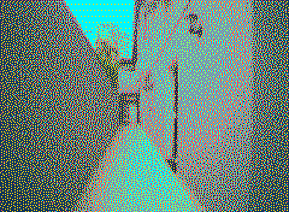
  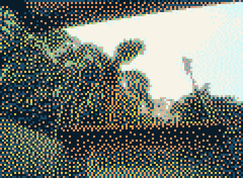
  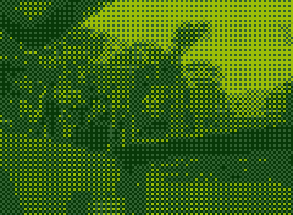
  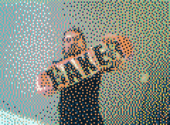
  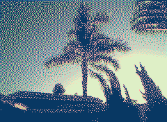
  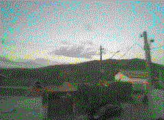
</p>

## User Interface Screenshots

<p align="center">
  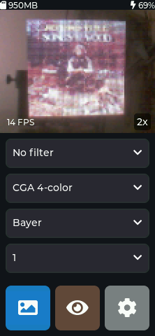
  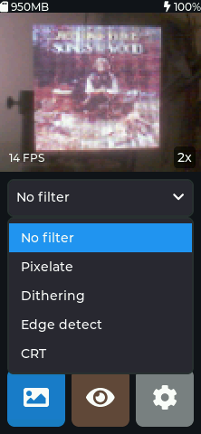
  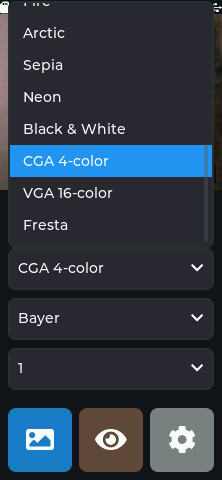
</p>

<p align="center">
  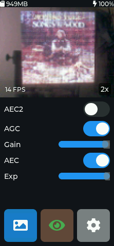
  
  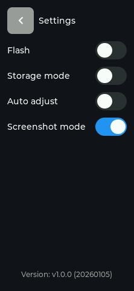

</p>

## Features

### Camera Capabilities
- **Live Preview**: Real-time camera feed at 240x176 (HQVGA) resolution
- **Software Digital Zoom**: 1x, 2x, and 4x zoom levels with center cropping
- **Photo Capture**: High-quality PNG image output with configurable processing
- **Auto-Adjust**: Automatic contrast, brightness, and gamma correction
- **Camera Controls**: AEC/AEC2, AGC, manual exposure and gain adjustment via UI sliders (not available on the stock GC0308 sensor)

### Real-Time Filters
- **Pixelate**: Block-based pixelation effect with adjustable block size
- **Dithering**: Color palette reduction with Floyd-Steinberg or Bayer dithering
- **Edge Detection**: Sobel operator-based edge detection with adjustable threshold
- **CRT Effect**: Retro CRT monitor simulation with RGB channel separation and scanline patterns

### Color Palettes
18 built-in color palettes including:
- Sunset, Cyberpunk, Autumn, Ocean, Desert, Sakura
- Gameboy, Grayscale, Sepia, Fire, Arctic, Neon
- 4-color, 16-color, and custom palettes

### Storage & Gallery
- PNG image encoding with optimal PSRAM/DRAM allocation
- Photos saved at 2x resolution (each pixel upscaled to 2x2) for better quality
- SD card photo storage with auto-increment naming
- Built-in gallery with touch navigation
- Quick access to last photo via long press on gallery button
- USB Mass Storage mode for direct file access

## Software Architecture

### Core Technologies
- **Platform**: Espressif 32 v6.3.0
- **Framework**: Arduino (ESP-IDF) v3.20009.0 (2.0.9)
- **UI Library**: LVGL v8.3.11
- **Display Driver**: TFT_eSPI v2.5.31
- **Touch Driver**: TouchLib v0.0.2 (CST92xx)
- **Image Encoding**: PNGenc v1.4.0
- **Power Management**: XPowersLib v0.3.2 (SY6970)

### Memory Management
- Strategic use of PSRAM for large buffers
- Efficient RGB565 pixel format throughout pipeline
- Zero-copy buffer strategies where possible
- Custom lodepng memory allocators for PSRAM usage

### Filter Pipeline
All filters operate in-place on RGB565 framebuffers with automatic byte swapping:

```
Camera Frame → Auto-Adjust → Filter → Zoom/Crop → Display
                                    ↓
                            Optional: PNG Encode → SD Card
```

## Building

### Prerequisites
- PlatformIO Core or PlatformIO IDE
- ESP32 toolchain (automatically installed by PlatformIO)

### Configuration
Edit `platformio.ini` to adjust:
- Upload speed
- Monitor speed
- Partition scheme
- Build flags

## Usage

### Home Screen 🏠
- **Status Bar**: Battery level and storage space
- **Camera Preview**: Tap to cycle through zoom levels (1x → 2x → 4x)
- **Filter Dropdown**: Select real-time filter effect
- **Palette Dropdown**: Choose color palette (for dithering filter)
- **Dithering Type**: Off, Floyd-Steinberg, or Bayer
- **Pixel Size**: 1x1, 2x2, 4x4, or 8x8 blocks
- **Camera Button** (physical): Capture and save photo to SD card

**Camera Settings Mode 👁️** :
- **Exposure**: Manual AEC value slider
- **Gain**: Manual AGC gain slider
- **Auto-Adjust**: Toggle automatic image enhancement

### Settings Screen ⚙️
- **Flash**: Toggle camera LED
- **Storage Mode**: Toggle storage switch to enable USB MSC mode for direct SD card access from computer.
- **Auto-Adjust**: Toggle automatic image enhancement

### Gallery Screen 🖼️
- Browse captured photos with paginated view
- **Gallery Button (tap)**: Open full gallery list
- **Gallery Button (long press)**: Quick preview of last photo taken
- Delete unwanted images
- Touch navigation between photos

## Technical Details

### Image Processing

**Pixelate Filter**
- Averages RGB values within NxN blocks
- Preserves color fidelity while reducing detail
- Configurable block sizes: 1, 2, 4, 8 pixels

**Dithering Algorithm**
- Floyd-Steinberg: Error diffusion for smooth gradients
- Bayer: Ordered dithering with threshold matrix
- Operates on custom color palettes with RGB565 conversion

**Edge Detection**
- Sobel operator (3x3 convolution kernels)
- Separate horizontal and vertical gradient computation

**CRT Filter**
- Block-based RGB channel separation
- Scanline-rotating pattern (R,G,B → B,R,G → G,B,R)
- Combined pixelation and color separation effect

### Camera Configuration
- Sensor: OV3660
- Pixel Format: RGB565
- Frame Size: HQVGA (240x176)
- Frame Buffer: Double-buffered in PSRAM

### Performance Optimizations
- Hardware SPI for display communication
- DMA transfers where applicable
- Filter algorithms optimized for RGB565
- Strategic frame buffer allocation in PSRAM

## Known Limitations

- Some filters may reduce frame rate on complex scenes
- The builtin camera settings need restart to take effect (not available on the stock GC0308 sensor)

## TODO

Future improvements and features to implement:

- **Better Zoom**: Implement smoother zoom transitions, more granular zoom levels (1.5x, 3x, etc.), or pinch-to-zoom gesture support
- **Dynamic Camera Settings**: Runtime adjustment of sensor parameters (saturation, white balance, special effects, image quality)
- **Advanced Gallery Features**: Photo editing, sharing capabilities, slideshow mode
- **Performance Optimization**: Increase frame rate for filters, optimize memory usage further
- **Additional Filters**: Blur, sharpen, vignette, color grading, vintage effects, double exposure
- **Timelapse Mode**: Interval shooting with automatic compilation
- **WiFi Features**: Remote camera control, live streaming, cloud backup
- **Battery Optimization**: Low-power modes, sleep scheduling
- **Storage features**: format, batch delete

## References

This project was built using the following resources:

- **LilyGo T-Display S3 Pro**: [Official Hardware Repository](https://github.com/Xinyuan-LilyGO/T-Display-S3-Pro)
- **T-Display S3 Pro Examples**: [nishad2m8's Project Examples](https://github.com/nishad2m8/T-Display-S3-Pro-YT)
- **LVGL Screenshot Library**: [lv_lib_100ask Screenshot Documentation](https://github.com/100askTeam/lv_lib_100ask/tree/master/src/lv_100ask_screenshot)
- **LVGL Snapshot Guide**: [LVGL Forum - How to Take a Snapshot](https://forum.lvgl.io/t/how-to-take-a-snapshot/9092)

## License

This project is licensed under the MIT License - see the [LICENSE](LICENSE) file for details.

This project uses open-source libraries:
- LVGL v8.3.11 (MIT License)
- TFT_eSPI v2.5.31 (FreeBSD License)
- PNGenc v1.4.0 (Apache 2.0)
- XPowersLib v0.3.2 (MIT License)
- TouchLib v0.0.2 (MIT License)

Hardware designed by LilyGo.