# Pixel Camera with LilyGo T-Display S3 Pro

A feature-rich camera application for the LilyGo T-Display S3 Pro with OV3660 camera module, featuring real-time filters, software digital zoom, and advanced image processing capabilities.

**Inspired by:** Carlo Andreini's [Pixless Camera](https://www.kickstarter.com/projects/carloandreini/pixless-camera) - a 0.03MP camera that captures charming pixel-art style photos, reminiscent of the iconic Game Boy Camera.

## Featured on Hackaday

This project was featured on Hackaday in the article [Pixel Camera Puts Lo-Fi Images In The Palm Of Your Hand](https://hackaday.com/2026/04/02/pixel-camera-puts-lo-fi-images-in-the-palm-of-your-hand/), published on April 2, 2026.

The post highlights the LilyGo T-Display S3 Pro hardware, the OV3660 camera swap, the real-time pixel-art filter pipeline, microSD photo storage, the built-in touch gallery, and USB Mass Storage support.

## Hardware


**Required:**

- LilyGo T-Display S3 Pro (ESP32-S3, 222x480 TFT display)
- MicroSD Card (for photo storage)

**Note:** This project uses the OV3660 camera module, which is different from the standard camera module typically bundled with the T-Display S3 Pro. Make sure you have the compatible OV3660 sensor for proper operation. I had to remove the transparent plastic cover due to the fact the OV3660 sensor is taller then the GC0308 sensor that comes with the device. The built-in camera settings and controls described here are not available on the stock GC0308 sensor.

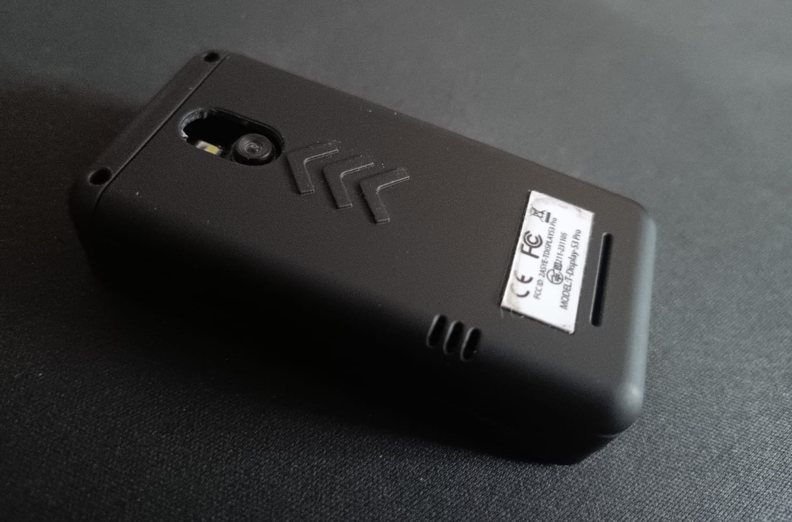

**Board Features:**

- ESP32-S3 dual-core processor (240MHz)
- 16MB Flash, 8MB PSRAM
- 222x480 IPS LCD display
- Capacitive touch screen
- Battery management (SY6970)
- USB Type-C
- Flash LED

## Sample Photos

<p align="center">
  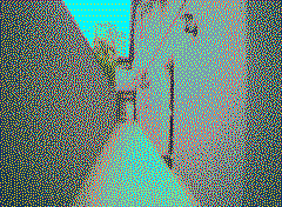
  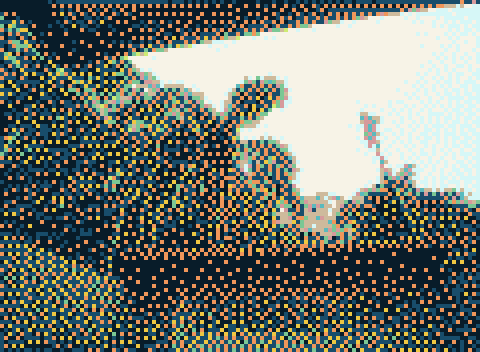
  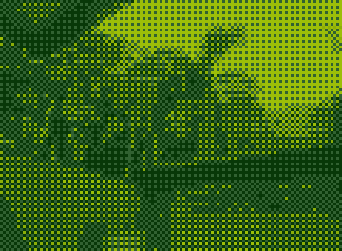
  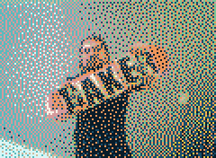
  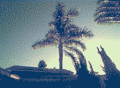
  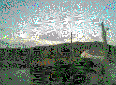
</p>

The following ones are from the version I did with a M5Stack cores3 that has a diferent camera, but the filters are the same.

<p align="center">
  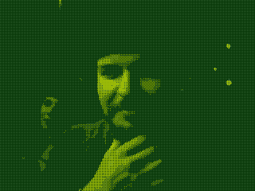
  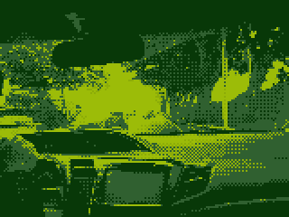
  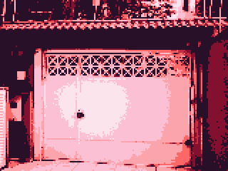
  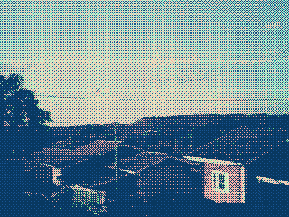
  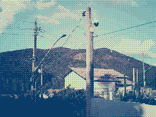
</p>

## Online Gallery

- Gallery repository: [bit-gallery](https://github.com/raulzanardo/bit-gallery)
- Gallery website: [raulzanardo.github.io/bit-gallery](https://raulzanardo.github.io/bit-gallery/)

## User Interface Screenshots

<p align="center">
  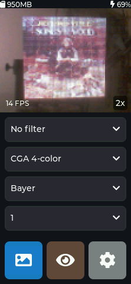
  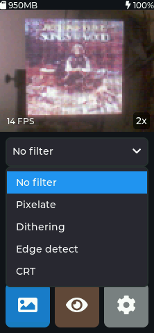
  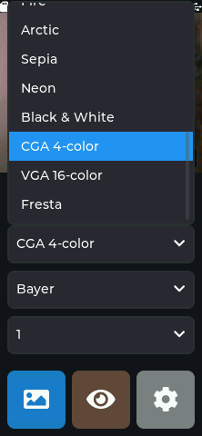
</p>

<p align="center">
  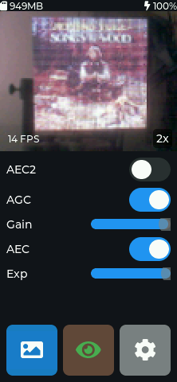
  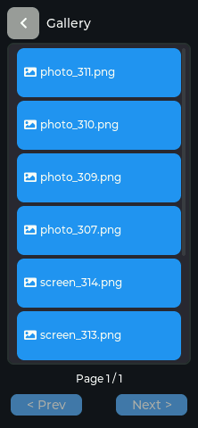
  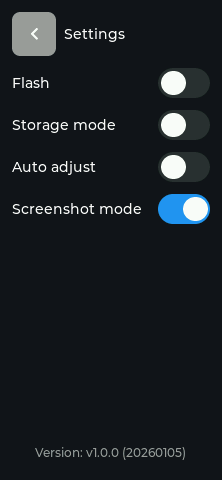

</p>

## Features

### Camera Capabilities

- **Live Preview**: Real-time camera feed at 240x176 (HQVGA) resolution with live FPS counter
- **Software Digital Zoom**: 1x, 2x, and 4x zoom levels with center cropping (tap preview to cycle)
- **Photo Capture**: High-quality PNG image output with configurable processing
- **Auto-Adjust**: Automatic contrast, brightness, and gamma correction
- **Auto Levels**: Automatic histogram stretching for the Color Palette filter
- **Camera Controls**: AEC/AEC2, AGC, manual exposure and gain adjustment via UI sliders (not available on the stock GC0308 sensor)
- **Startup Optimizations**: WiFi and Bluetooth disabled at boot to save power and reduce RF noise

### Real-Time Filters

- **None**: Pass-through with optional Auto-Adjust
- **Pixelate**: Block-based pixelation effect with adjustable block size (1×1 to 8×8)
- **Dithering**: Configurable color depth reduction with:
  - Algorithm: Floyd-Steinberg (error diffusion) or Bayer (ordered)
  - Bits per channel: 1, 2, 3, or 4
  - Grayscale mode toggle
  - Bayer matrix size: 2×2, 4×4, or 8×8 (when Bayer algorithm selected)
- **Color Palette**: Map each pixel to the nearest color in a palette, with optional dithering and pixel size grouping
- **Edge Detection**: Sobel operator-based edge detection
- **CRT Effect**: Retro CRT monitor simulation with RGB channel separation, scanline patterns, and adjustable pixel size
- **Multi Exposure**: Temporal blend of the last few frames for a ghosted long-exposure look, with adjustable frame count and blend style

### Color Palettes

19 built-in color palettes:

- Sunset, Yellow-Brown, Grayscale, Gameboy, Cyberpunk, Autumn
- Ocean, Desert, Sakura, Mint, Fire, Arctic, Sepia, Neon
- Black & White, 4-color, 16-color, Fresta, RGB

### Storage & Gallery

- PNG image encoding with optimal PSRAM/DRAM allocation
- Photos saved at 2x resolution (each pixel upscaled to 2×2) for better quality
- SD card photo storage with auto-increment naming
- Built-in gallery with touch navigation
- Quick access to last photo via long press on gallery button
- USB Mass Storage mode for direct SD card access from computer
- **SD Card Format**: Wipe all SD card contents from the Settings screen with a confirmation dialog and progress overlay

### Screenshot Mode

- Toggle screenshot mode in the Settings screen
- When active, the physical shutter button captures a full-screen BMP screenshot of the current UI instead of a camera photo
- Screenshots saved to the SD card alongside regular photos

### Persistent Settings

All user preferences are saved to non-volatile storage (NVS) and automatically restored on next boot:

- Selected filter and palette
- Flash enabled state
- Zoom level
- Dithering options (algorithm, bits, grayscale, Bayer size)
- Multi Exposure options (frame count and blend mode)
- Camera sensor controls (AEC, AEC2, AGC gain, exposure value)
- Auto-Adjust and Auto Levels toggles
- Screenshot mode toggle

## Software Architecture

### Core Technologies

- **Platform**: Espressif 32 v6.3.0
- **Framework**: Arduino (ESP-IDF) v3.20009.0 (2.0.9)
- **UI Library**: LVGL v8.3.11
- **Display Driver**: TFT_eSPI v2.5.31
- **Touch Driver**: TouchLib v0.0.2 (CST92xx)
- **Image Encoding**: PNGenc v1.4.0
- **Power Management**: XPowersLib v0.3.2 (SY6970)

### Memory Management

- Strategic use of PSRAM for large buffers
- Efficient RGB565 pixel format throughout pipeline
- Zero-copy buffer strategies where possible
- Custom lodepng memory allocators for PSRAM usage

### Filter Pipeline

All filters operate in-place on RGB565 framebuffers with automatic byte swapping:

```
Camera Frame → Auto-Adjust → Filter → Zoom/Crop → Display
                                    ↓
                            Optional: PNG Encode → SD Card
```

## Building

### Prerequisites

- PlatformIO Core or PlatformIO IDE
- ESP32 toolchain (automatically installed by PlatformIO)

### Configuration

Edit `platformio.ini` to adjust:

- Upload speed
- Monitor speed
- Partition scheme
- Build flags

## Usage

### Home Screen 🏠

- **Status Bar**: Battery level (with charging indicator), USB status, and SD card free space
- **Camera Preview**: Tap to cycle through zoom levels (1x → 2x → 4x); current zoom shown as overlay
- **FPS Counter**: Real-time frames-per-second display
- **Filter Dropdown**: Select real-time filter effect (None, Pixelate, Dithering, Color Palette, Edge, CRT, Multi Exposure)
- **Palette Dropdown**: Choose color palette (for Color Palette filter)
- **Dithering Type**: Off, Floyd-Steinberg, Bayer (for Color Palette filter)
- **Pixel Size**: 1×1, 2×2, 4×4, or 8×8 blocks (for Pixelate, Color Palette, and CRT filters)
- **Dither Controls** (for Dithering filter): algorithm, bits per channel, grayscale toggle, Bayer matrix size
- **Camera Button** (physical): Capture and save photo to SD card (or screenshot in screenshot mode)

**Camera Settings Mode 👁️** (toggle via eye icon button):

- **AEC2**: Toggle enhanced auto-exposure algorithm (requires restart)
- **Auto-Exposure**: Toggle AEC on/off
- **Exposure**: Manual AEC value slider (0–1200, active when AEC is off; requires restart)
- **Auto-Gain**: Toggle AGC on/off
- **Gain**: Manual AGC gain slider (0–30, active when AGC is off; requires restart)
- **Auto-Adjust**: Toggle automatic image enhancement per-frame

### Settings Screen ⚙️

- **Flash**: Toggle camera LED flash on shutter press
- **Storage Mode**: Enable USB MSC mode to mount the SD card directly on a computer
- **Auto-Adjust**: Toggle per-frame automatic contrast/brightness/gamma enhancement
- **Auto Levels**: Toggle automatic histogram stretching for Color Palette filter
- **Screenshot Mode**: When enabled, the physical button saves a full-screen BMP instead of a camera PNG
- **Format SD Card**: Wipe all files from the SD card (confirmation dialog + progress overlay)

### Gallery Screen 🖼️

- Browse captured photos with paginated view
- **Gallery Button (tap)**: Open full gallery list
- **Gallery Button (long press)**: Quick preview of last photo taken
- Delete unwanted images
- Touch navigation between photos

## Technical Details

### Image Processing

**Pixelate Filter**

- Averages RGB values within NxN blocks
- Preserves color fidelity while reducing detail
- Configurable block sizes: 1, 2, 4, 8 pixels

**Dithering Algorithm**

- Floyd-Steinberg: Error diffusion for smooth gradients
- Bayer: Ordered dithering with configurable threshold matrix (2×2, 4×4, 8×8)
- Configurable bits per channel (1–4) and optional grayscale mode
- Operates on custom color palettes with RGB565 conversion

**Color Palette Filter**

- Maps each pixel to the nearest color in the selected palette
- Optional dithering (Floyd-Steinberg or Bayer) and pixel size grouping
- Optional auto histogram stretching (Auto Levels) for better contrast

**Edge Detection**

- Sobel operator (3x3 convolution kernels)
- Separate horizontal and vertical gradient computation

**CRT Filter**

- Block-based RGB channel separation
- Scanline-rotating pattern (R,G,B → B,R,G → G,B,R)
- Combined pixelation and color separation effect

### Camera Configuration

- Sensor: OV3660
- Pixel Format: RGB565
- Frame Size: HQVGA (240x176)
- Frame Buffer: Double-buffered in PSRAM

### Performance Optimizations

- Hardware SPI for display communication
- DMA transfers where applicable
- Filter algorithms optimized for RGB565
- Strategic frame buffer allocation in PSRAM

## Known Limitations

- Some filters may reduce frame rate on complex scenes
- The builtin camera settings need restart to take effect (not available on the stock GC0308 sensor)

## TODO

Future improvements and features to implement:

- **Better Zoom**: Implement smoother zoom transitions, more granular zoom levels (1.5x, 3x, etc.), or pinch-to-zoom gesture support
- **Dynamic Camera Settings**: Runtime adjustment without restart (saturation, white balance, special effects)
- **Advanced Gallery Features**: Photo editing, sharing capabilities, slideshow mode, batch delete
- **Performance Optimization**: Increase frame rate for filters, optimize memory usage further
- **Additional Filters**: Blur, sharpen, vignette, color grading, vintage effects
- **Timelapse Mode**: Interval shooting with automatic compilation
- **WiFi Features**: Remote camera control, live streaming, cloud backup
- **Battery Optimization**: Low-power modes, sleep scheduling
- **Printer integration**: Thermal printer support

## References

This project was built using the following resources:

- **LilyGo T-Display S3 Pro**: [Official Hardware Repository](https://github.com/Xinyuan-LilyGO/T-Display-S3-Pro)
- **T-Display S3 Pro Examples**: [nishad2m8's Project Examples](https://github.com/nishad2m8/T-Display-S3-Pro-YT)
- **LVGL Screenshot Library**: [lv_lib_100ask Screenshot Documentation](https://github.com/100askTeam/lv_lib_100ask/tree/master/src/lv_100ask_screenshot)
- **LVGL Snapshot Guide**: [LVGL Forum - How to Take a Snapshot](https://forum.lvgl.io/t/how-to-take-a-snapshot/9092)

## License

This project is licensed under the MIT License - see the [LICENSE](LICENSE) file for details.

This project uses open-source libraries:

- LVGL v8.3.11 (MIT License)
- TFT_eSPI v2.5.31 (FreeBSD License)
- PNGenc v1.4.0 (Apache 2.0)
- XPowersLib v0.3.2 (MIT License)
- TouchLib v0.0.2 (MIT License)

Hardware designed by LilyGo.
